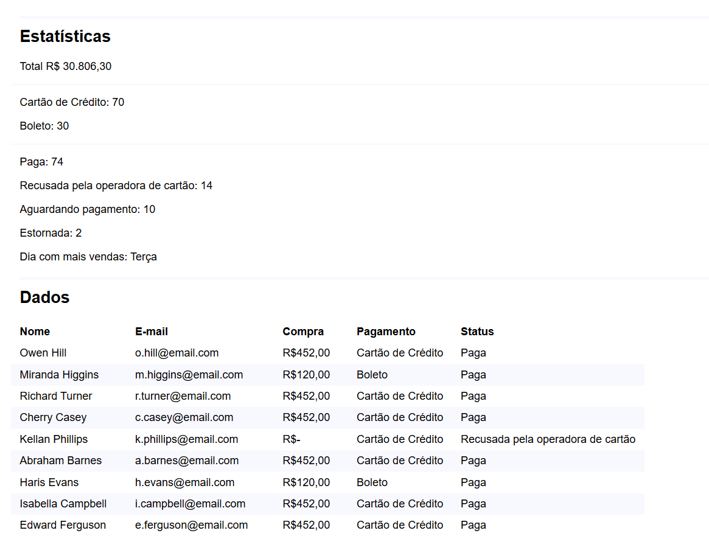

# 🖥️ Prática TypeScript – Projeto Final do Curso Origamid

Este é o projeto desenvolvido como parte do curso **[TypeScript para Iniciantes](https://www.origamid.com/curso/typescript-para-iniciantes/)** da Origamid.
O objetivo foi a prática do TypeScript, foi realizado dois pequenos projetos, um para manipulação de dados e o outro para manipulação do DOM
---

## 🚀 Preview  
🔗 [Acesse o projeto online aqui]()  
 
 

---

## 🛠 Tecnologias utilizadas  
- **HTML5**
- **CSS3**
- **TypeScript**

---

## ✅ Status do projeto  
✅ Concluído

## 📝 Observações 
- Projeto feito de forma guiada durante as aulas do curso Origamid. 
- O design e o código foram mantidos próximos ao exemplo do professor, com o objetivo de consolidar os fundamentos do TypeScript.